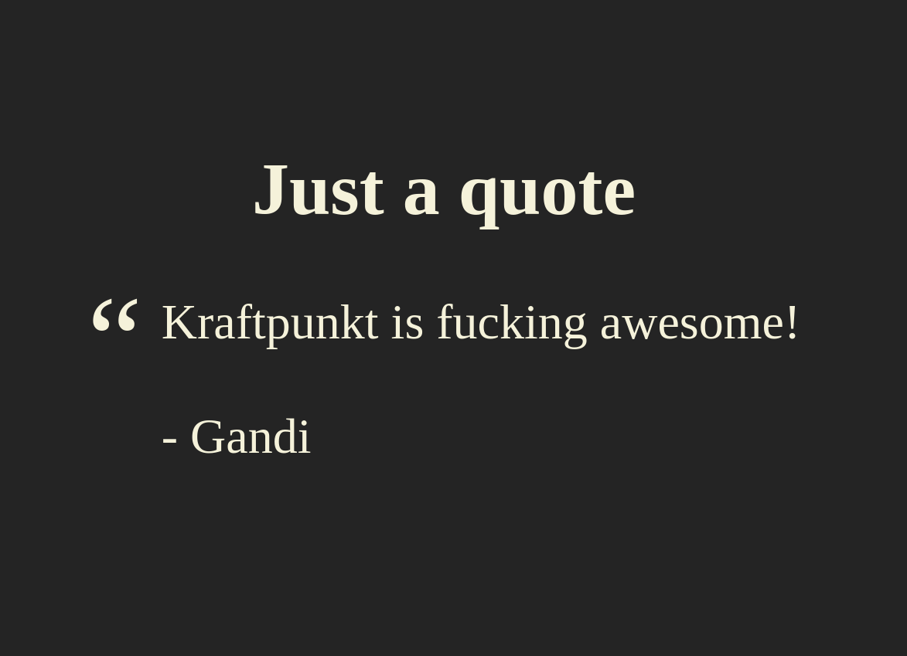

# Kraftpunkt

Quickly turn an HTML file into a presentation.

## Installation

Import the JavaScript and stylesheet files in the `<head>` of the HTML file:

```html
<link href='https://cdn.jsdelivr.net/gh/Baukereg/kraftpunkt/kraftpunkt.css' rel='stylesheet' crossorigin='anonymous' />
<script src='https://cdn.jsdelivr.net/gh/Baukereg/kraftpunkt/kraftpunkt.js' type='text/javascript'></script>
```

Initialize Kraftpunkt:

```html
<body onload='init()'>
```

## Controls

Use the left and right arrow keys to navigate between the slides.

## Create slides

Slides are just `<section>` elements in the root of the HTML body.

```html
<body>
  <section>
    <h1>A primary title</h1>
  </section>
  
  <section>
    <h2>A secundary title</h2>
    <article>Just some text...</article>
    <a href='https://cataas.com/' target='_blank'>Just cats</a>
  </section>

  <section>
    <ul>
      <li>Just a list</li>
      <li>of whatever you want...</li>
      <li>Don't forget to use emojis! 💩</li>
    </ul>
  </section>

  <section>
    <h2>Just a quote</h2>
    <blockquote>
      Kraftpunkt is fucking awesome!<br /><br />
      - Gandi
    </blockquote>
  </section>

  <section>
    <h2>Always include cat pics!</h2>
    
  </section>

  <section>
    <code>git push -f</code>
  </section>

  <section>
    <h2>Just a table with frogs</h2>
    <table>
      <thead>
        <tr>
          <th>Num.</th>
          <th>Frogs</th>
        </tr>
      </thead>
      <tbody>
        <tr>
          <td>Just 1</td>
          <td>🐸</td>
        </tr>
        <tr>
          <td>Omg 3 of 'm!</td>
          <td>🐸🐸🐸</td>
        </tr>
      </tbody>
    </table>
  </section>
</body>
```

## Possible future improvements

* On screen controls.
* Configurable background and text colors.
* Beter `<code>` formatting.
* Video embedding.
* Slide notes, visible in seperate window.

## Screenshots



